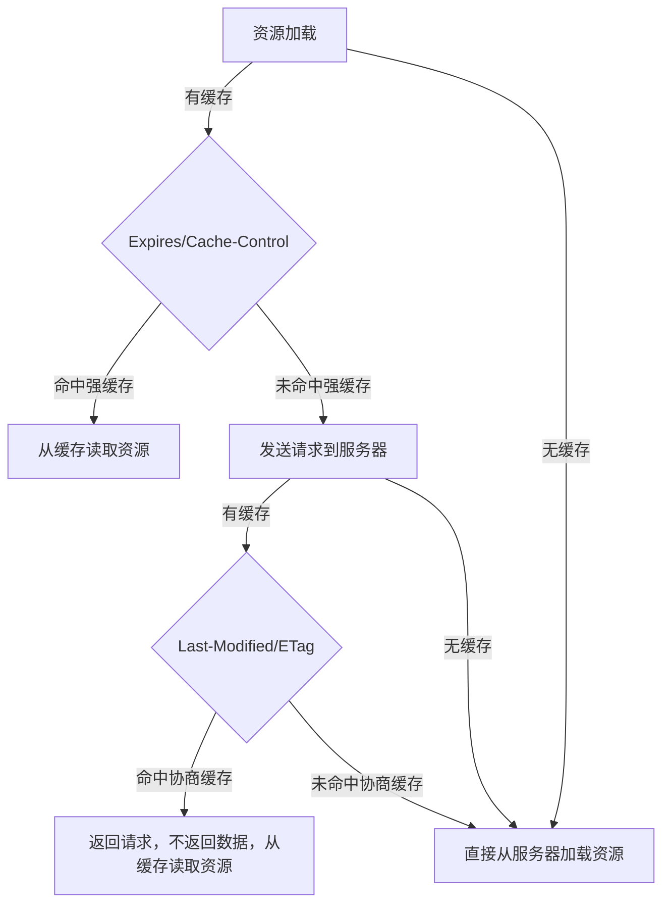

---
{"dg-publish":true,"permalink":"/01-frontend/network/net-cache/","title":"HTTP - 缓存","tags":["cache","http","interview"],"created":"2024-06-04T10:38:39.579+08:00","updated":"2024-07-03T11:24:57.942+08:00"}
---

#### ANKI-浏览器缓存流程：

- 1）浏览器在加载资源时，根据请求头的`expires`和`cache-control`判断是否命中强缓存，是则直接从缓存读取资源，不会发请求到服务器。
- 2）如果没有命中强缓存，浏览器一定会发送一个请求到服务器，通过`last-modified`和`etag`验证资源是否命中协商缓存，如果命中，服务器会将这个请求返回，但是不会返回这个资源的数据，依然是从缓存中读取资源
- 3）如果前面两者都没有命中，直接从服务器加载资源
大致的顺序
- Cache-Control —— 请求服务器之前
- Expires —— 请求服务器之前
- If-None-Match (Etag) —— 请求服务器
- If-Modified-Since (Last-Modified) —— 请求服务器
协商缓存需要配合强缓存使用，如果不启用强缓存的话，协商缓存根本没有意义
大部分web服务器都默认开启协商缓存，而且是同时启用【Last-Modified，If-Modified-Since】和【ETag、If-None-Match】
ID: 1717469946234

#### ANKI-浏览器缓存的位置：
请求一个资源时，会按照优先级（Service Worker -> Memory Cache -> Disk Cache -> Push Cache）依次查找缓存，如果命中则使用缓存，否则发起请求
**200 from memory cache**
表示不访问服务器，直接从内存中读取缓存。因为缓存的资源保存在内存中，所以读取速度较快，但是关闭进程后，缓存资源也会随之销毁，一般来说，系统不会给内存分配较大的容量，因此内存缓存一般用于存储较小文件。同时内存缓存在有时效性要求的场景下也很有用（比如浏览器的隐私模式）。
**200 from disk cache**
表示不访问服务器，直接从硬盘中读取缓存。与内存相比，硬盘的读取速度相对较慢，但硬盘缓存持续的时间更长，关闭进程之后，缓存的资源仍然存在。由于硬盘的容量较大，因此一般用于存储大文件。
存储图像和网页等资源主要缓存在disk cache，操作系统缓存文件等资源大部分都会缓存在memory cache中。==具体操作浏览器自动分配，看谁的资源利用率不高就分给谁==
**Push Cache** Http2：
Push Cache是一种推送式缓存，由服务器主动将资源推送给浏览器进行缓存。这种方式主要用于优化网页的首次加载速度。

#### ANKI-强缓存
强缓存通过`Expires`和`Cache-Control`两种响应头实现
1、Expires
Expires是http1.0提出的一个表示资源过期时间的header，它描述的是一个绝对时间，由服务器返回。
Expires 受限于本地时间，如果修改了本地时间，可能会造成缓存失效
`Expires: Wed, 11 May 2018 07:20:00 GMT`
2、Cache-Control
Cache-Control 出现于 HTTP / 1.1，优先级高于 Expires ,表示的是相对时间
`Cache-Control: max-age=315360000`
ID: 1717469946238


#### ANKI-协商缓存
当浏览器对某个资源的请求没有命中强缓存，就会发一个请求到服务器，验证协商缓存是否命中，如果协商缓存命中，请求响应返回的http状态为304并且会显示一个Not Modified的字符串
//
协商缓存是利用的是`【Last-Modified，If-Modified-Since】`和`【ETag、If-None-Match】`这两对Header来管理的
//
`Last-Modified` 表示本地文件最后修改日期，浏览器会在request header加上`If-Modified-Since`（上次返回的`Last-Modified`的值），询问服务器在该日期后资源是否有更新，有更新的话就会将新的资源发送回来
//
`Etag`就像一个指纹，资源变化都会导致ETag变化，跟最后修改时间没有关系，`ETag`可以保证每一个资源是唯一的
//
`If-None-Match`的header会将上次返回的`Etag`发送给服务器，询问该资源的`Etag`是否有更新，有变动就会发送新的资源回来
ID: 1717469946240


## 具体说明
### 强缓存

**不会向服务器发送请求**，直接从缓存中读取资源
#### 如何判断强缓存是否失效
当浏览器向服务器请求数据的时候，服务器会将数据和缓存的规则返回，在**响应头的 header 中**，有两个字段 **Expires** 和 **Cache-Control**。
#### Expires
```http
expires: Wed, 11 Sep 2019 16:12:18 GMT
```
存储资源过期时间戳，在浏览器请求数据的时候，会使用本地时间先和这个时间戳比较，判断是否过期。
#### Cache- control （http1.1）：
对于 Expires 如果我手动改变了本地时间，那么 Expires 就没有意义了。为了解决这个问题，**HTTP1.1** 添加了 Cache-Control；

```http
Cache-Control:max-age=7200
```

> 服务器和客户端说，这个资源缓存只可以存在 7200 秒，在这个时间段之内，你就可以在缓存获取资源。

如果 Expire 和 Cache-control 两者同时出现，则以 Cache-control 为主

Cache-control 的额外字段

```http
cache-control: max-age=3600, s-maxage=31536000
```

- **Public**：只要为资源设置了 public，那么它既可以被浏览器缓存，也可以被代理服务器缓存；
- **Private(默认值)**：则该资源只能被浏览器缓存。
- **no-store：**不使用任何缓存，直接向服务器发起请求。
- **no-cache：**绕开浏览器缓存（每次发起请求不会询问浏览器缓存），而是直接向服务器确认该缓存是够过期。

利用 cache control 提供的字段可以实现一套完整的缓存策略

## 协商缓存


协商缓存流程：

1. 从本地取出数据标识符，向服务器验证是否失效，
2. 没失效，则从本地取出数据
3. 失效，从服务器获取新的数据和标识符
### 如何判断协商缓存

协商缓存: 判断**服务端资源**是否有改动，如果有则更新缓存，如果没有则使用缓存

主要通过报文头部 header 中的**Last-Modified**，**If-Modified-Since** 以及**ETag**、**If-None-Match** 字段来进行识别

### Last-Modified & If-Modified-Since(存储时间戳)

浏览器**第一次访问**服务器资源：

- 因为是第一次访问该页面，客户端发请求时，请求头中没有 If-Modified-Since 标签。

- 服务器返回的 HTTP 头标签中有 Last-Modified，告诉客户端页面的最后修改时间。

(**资源没有改变**)浏览器第二次访问服务器资源：

- 客户端发 HTTP 请求时，使用 If-Modified-Since 标签，把上次服务器告诉它的文件最后修改时间返回到服务器端
- 因为文件没有发生改变,服务器返回 304

**(资源发生改变)**浏览器第三次访问服务器资源

- 客户端发 HTTP 请求时，使用 If-Modified-Since 标签，把上次服务器告诉它的文件最后修改时间返回到服务器端
- 因为文件发生改变，服务器做如下操作
  - 状态码：200
  - header 中带有 Last-modified 告诉客户端页面最新的资源修改时间
  - body 返回新的内容

缺陷：精度低，只能以秒计时

### Etag & If-None-Match （http1.1，资源唯一标识符）

ETag 代表的意思是**标识字符串**。对资源进行内容编码，只有内容被改变，这个编码才不同

请求原理和上面的 Last-Modified 相同

服务端返回

```http
ETag: W/"2a3b-1602480f459"
```

浏览器携带

```http
If-None-Match: W/"2a3b-1602480f459"
```

## 缓存位置

缓存位置从上到下：
1. Memory Cache：读取高效，持续时间短
2. Service Worker：PWA 的实现核心，可以自主控制缓存内容，如何匹配，如何读取
3. Disk Cache：磁盘缓存，读取速度慢，但是容量和存储时效性都更好
4. Push Cache：推送缓存，属于 HTTP2 的内容,国内资源太少。。。
## 总结

1. 强缓存优先于协商缓存
2. 协商缓存失效，返回 200，重新返回资源和缓存标识
3. 协商缓存生效则返回 304， 继续使用缓存